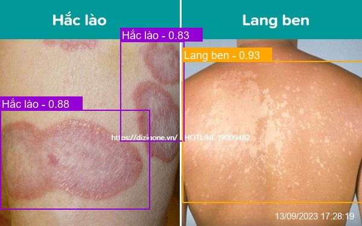
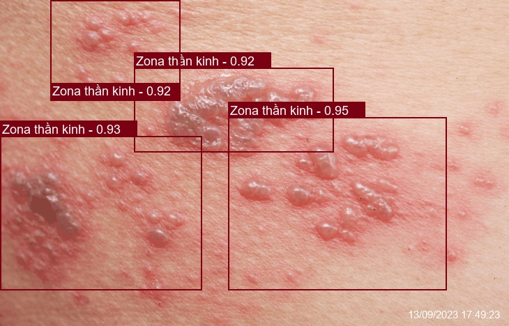

<div align="center">
  <p>
    <a align="center" href="https://ultralytics.com/yolov5" target="_blank">
      </a>
  </p>

[English](README.md) | [简体中文](README.zh-CN.md)
<br>

<div>
    <a href="https://github.com/ultralytics/yolov5/actions/workflows/ci-testing.yml"></a>
    <a href="https://zenodo.org/badge/latestdoi/264818686"></a>
    <a href="https://hub.docker.com/r/ultralytics/yolov5"></a>
    <br>
    <a href="https://bit.ly/yolov5-paperspace-notebook"></a>
    <a href="https://colab.research.google.com/github/ultralytics/yolov5/blob/master/tutorial.ipynb"></a>
    <a href="https://www.kaggle.com/ultralytics/yolov5"></a>
  </div>
  <br>

YOLOv5 🚀 is the world's most loved vision AI, representing <a href="https://ultralytics.com">Ultralytics</a> open-source research into future vision AI methods, incorporating lessons learned and best practices evolved over thousands of hours of research and development.

We hope that the resources here will help you get the most out of YOLOv5. Please browse the YOLOv5 <a href="https://docs.ultralytics.com/yolov5">Docs</a> for details, raise an issue on <a href="https://github.com/ultralytics/yolov5/issues/new/choose">GitHub</a> for support, and join our <a href="https://ultralytics.com/discord">Discord</a> community for questions and discussions!

To request an Enterprise License please complete the form at [Ultralytics Licensing](https://ultralytics.com/license).

<div align="center">
  <a href="https://github.com/ultralytics" style="text-decoration:none;">
    </a>
  
  <a href="https://www.linkedin.com/company/ultralytics/" style="text-decoration:none;">
    </a>
  
  <a href="https://twitter.com/ultralytics" style="text-decoration:none;">
    </a>
  
  <a href="https://youtube.com/ultralytics" style="text-decoration:none;">
    </a>
  
  <a href="https://www.tiktok.com/@ultralytics" style="text-decoration:none;">
    </a>
  
  <a href="https://www.instagram.com/ultralytics/" style="text-decoration:none;">
    </a>
  
  <a href="https://ultralytics.com/discord" style="text-decoration:none;">
    </a>
</div>

In this repository, i will using yolov5 to detect the skin disense with the input is an image and the output is a dict contain xmax, ymax, xmin, ymin, score and label of disense.

</div>
<br>

## <div align="left">Install</div>

1. Download this weight name [best.pt](https://drive.google.com/file/d/11CMf6nW1meckuQMz_mJbEzjleGuMJOWC/view?usp=drive_link) and save with the following path: public/files/weight_init/best.pt

2. Create and activate a virtual environment:

    ```sh
    $ python3 -m venv venv && source venv/bin/activate
    ```
  
3. Install the requirements:

    ```sh
    (venv)$ pip install -r requirements.txt
    ```

4. Run

    ```sh
    (venv)$ python main.py
    ```

## <div align="left">Example</div>

I wrote an example code that sends an input image, receives the output, and uses that result to draw on the input image.

Run in different console while running main.py

```python
    (venv)$ python test/test_client.py
```

{
    "content": [
        {
            "label": "Hắc lào",
            "score": "0.90",
            "xmax": 436,
            "xmin": 339,
            "ymax": 238,
            "ymin": 136
        },
        {
            "label": "Lang ben",
            "score": "0.91",
            "xmax": 306,
            "xmin": 203,
            "ymax": 169,
            "ymin": 45
        },
        {
            "label": "Hắc lào",
            "score": "0.93",
            "xmax": 537,
            "xmin": 414,
            "ymax": 213,
            "ymin": 83
        },
        {
            "label": "Lang ben",
            "score": "0.93",
            "xmax": 223,
            "xmin": 0,
            "ymax": 281,
            "ymin": 101
        },
        {
            "detected_image": "resources/images/2023/09/13/detect/17284113092023_detected.jpg",
            "original_image": "resources/images/2023/09/13/original/17284113092023_original.jpg"
        }
    ],
    "status_code": 200
}

<div align="center">
  <p>
    </a>
    </a>
  </p>

